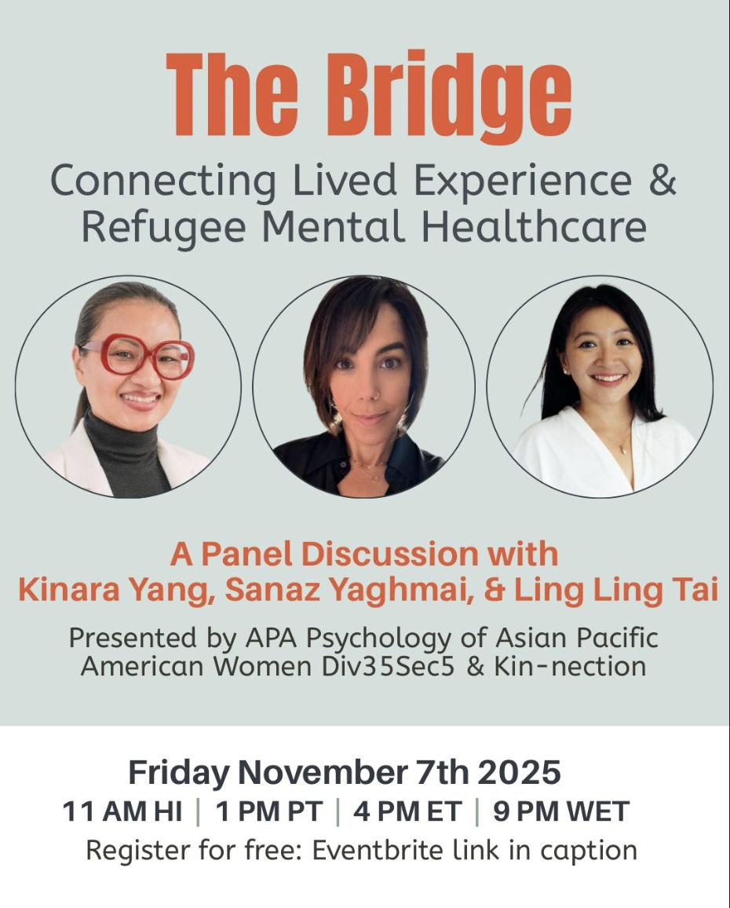

+++
date = '2025-11-08T00:00:00+00:00'
draft = false
categories = 'talks'
description = 'This 70-minute virtual panel about the unique psychological and sociocultural adaptation processes of refugees in both resettled and transit countries.'
title = 'BRIDGE: Connecting Lived Experience & Refugee Mental Healthcare'
+++

{style="width:70%;"}

This 70-minute virtual panel brings together researchers, practitioners, and refugees who have lived and worked within displacement contexts across West and Southeast Asia. Panelists will discuss the unique psychological and sociocultural adaptation processes of refugees in both resettled and transit countries, highlighting how these experiences differ from other migrant groups. The discussion will also deepen understanding of the specific needs and strengths of women refugees, offering insights to enhance culturally responsive mental health practice.

**Panelists**
- Kinara Yang, PharmD, RPh
- Sanaz Yaghmai, PsyD
- Ling Ling Tai, Ling Ling Tai, MPsych

**Moderators**
- Jennifer Young, PsyD 
- Jacinda Lee, ALMFT

This [live webinar](https://app.tpn.health/education/bridge-connecting-lived-experience-refugee-mental-healthcare-b61ffbf0) took place on the 7th November 2025, and sponsored by APA Division 35: Society for the Psychology of Women